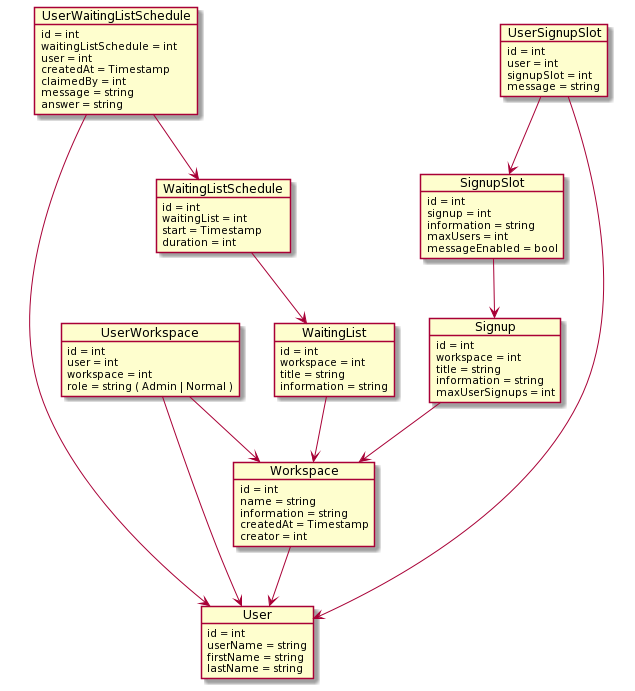

# Tosca Backend
The repository contains the backend for Tosca.

## Setup and configuration
Copy the `.env.example` to `.env` and modify if needed.

The application has extra configuration options that can
be configured in a `HOCON` file. See `./src/main/resources/application.conf` (loaded by default) for
a sample configuration. The application can be launched with a separate configuration
file with the `-config` parameter. The configuration file contains a mix of constants and values
loaded from environment variables.

## IntelliJ setup

The main application depends on a couple of environment variables. 
Make sure that environment variables present in `.env` is loaded
or set in IntelliJ.

## Running
Start the backend with:
```
make
```

To start everything except the Ktor server, useful for development, there is also the command:
```
make dev
```

## OpenAPI / Swagger

The endpoints of the Tosca backend are documented using `OpenAPI 3.1`, in [swagger/api.yaml](swagger/api.yaml).
A Swagger UI of the documented endpoints can be viewed on [http://localhost:8081](http://localhost:8081) after
running `docker-compose up` or `make dev`.

## Sentry

Tosca backend can be configured to log exceptions and errors to Sentry. See the `SENTRY_DSN` environment variable.

## OpenID Connect

OpenID Connect (OIDC) is used to provide authentication of users. The OIDC fields can be configured using the environment
variables as well as the HOCON file. See configuration above. 

Tosca requires four claims from the OIDC provider:
* `id` -> A unique user id
* `firstName` 
* `lastName`
* `groups` -> An array of the following groups [SuperUser, Admin, Everyone] (Not case-sensitive)

## Groups and roles
Access and permissions in Tosca are managed by *groups* and *roles*. Groups are controlled externally and
loaded via OIDC, while roles are assigned and managed by Tosca.

### Groups
A user of Tosca can be part of many of the groups provided in the OIDC claim, but only the group
with the highest permission level is used (`SuperUser > Admin > Everyone`). The permissions of the different
groups are as follows:

#### SuperUser

Can manage users and manage all workspaces.

#### Admin
Can create new workspaces, and manage workspaces that the user has created.

#### Everyone

Can access and sign up to waiting lists and signups that the user has access to.

### Roles
Users can have a role for a specific workspace, the roles are stored and controlled by
Tosca. The roles are as follows: 
* Admin -> Can manage and administer a workspace, like creating waiting lists.
* Normal -> Can sign up to signups and waiting lists created in the workspace.
* (Creator) -> The creator of a workspace can do everything that an Admin can, and also
  manage user roles for the workspace and delete the workspace. A workspace can only have one
  creator, and the creator can only be changed by a SuperUser.


## Model

The data model of Tosca consist of the following entities.

### User
A user of Tosca. The user is stored in Tosca for convenience, but the real source of truth of users is
considered to be the OIDC provider. A user is identified by either a unique integer `id`, or it's `userName`.
Users are updated every time a login is performed.

### Workspace
A workspace is a grouping of waiting lists, signups and users. A workspace has a `creator`, which is the user
that created the workspace, or have been assigned the creator role by a SuperUser. The creator has full administrative
rights over its workspace.

### UserWorkspace
Maps a user to a workspace with a role. See roles for more information. 

### WaitingList
A waiting list is a list where a user can sign up, potentially with a message, and where
workspace admins can claim, answer and remove users.

### WaitingListSchedule
A scheduled time when a waiting list will be open and available for normal users to sign up.

### UserWaitingListSchedule
A signed-up user to the waiting list. The user can sign up with an optional message, which can be answered by an admin.
A signed-up user can be marked/claimed by a workspace admin.

### Signup
A signup represents a specific event a user can sign up to, potentially in groups. A signup consist of `slots`, which
a user can sign up to. Workspace admins can control how many users that can sign up to a specific slot, and how many slots
a user should be able to sign up to in the entire signup. 

### SignupSlot
A signup slot is a specific slot users can sign up to for a signup.

### UserSignupSlot
Represents a user that has signed up to a slot, potentially with a message if enabled by workspace admins.



